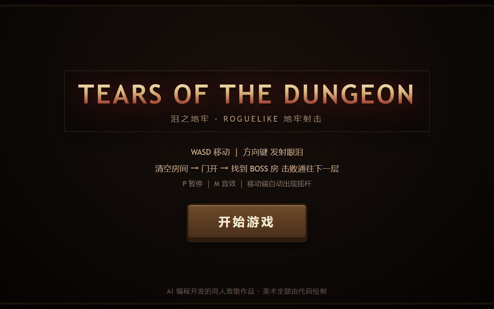
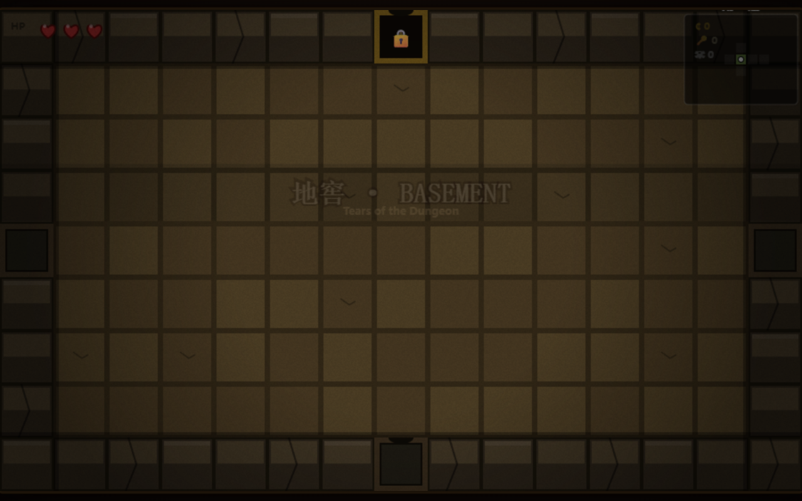

# Tears of the Dungeon · 泪之地牢

一个用纯原生 Canvas 2D + JavaScript（ES2020，零依赖、零构建）实现的肉鸽地牢射击网页游戏，复刻《以撒的结合》核心玩法：随机地牢、眼泪射击、道具强化、Boss 战与三层通关。




## 技术选型

| 项目 | 选择 | 说明 |
| --- | --- | --- |
| 渲染 | 原生 Canvas 2D | 所有素材（角色/敌人/Boss/地板/门/道具图标）全部代码绘制，无任何图片资源 |
| 语言 | ES2020 原生 JS | 无框架、无构建步骤、零外部依赖 |
| 随机 | mulberry32 播种随机 | 同一 seed 可完整复现地牢与掉落 |
| 地牢 | BFS 网格算法 | 9×7 网格随机生长，无环路走廊，Boss 房在最远死胡同 |
| 音频 | WebAudio 程序化合成 | 射击/爆炸/受击/道具/Boss 吼叫等音效全部实时合成 |
| 测试 | Node VM 无头冒烟 + Playwright 真浏览器 E2E | 双轨验证 |

## 启动方式

无需安装任何依赖，两种方式任选：

**方式一：直接双击** `index.html` 在浏览器打开即可游玩。

**方式二：本地服务器**（推荐，可体验完整功能）：

```bash
python -m http.server 8000
# 浏览器访问 http://localhost:8000
```

## 操作说明

| 操作 | 键位 |
| --- | --- |
| 移动 | `W` `A` `S` `D`（移动方向也会影响射击方向） |
| 射击 | `↑` `↓` `←` `→` 方向键 |
| 开始 / 重新开始 / 再来一局 | `Enter` 或 `Space` |
| 暂停 / 继续 | `P` |
| 静音 | `M` |

**移动端**：左侧虚拟摇杆控制移动，右侧四个方向按钮射击。

## 系统清单

### 地牢与房间
- 随机生成 9×7 网格地牢，每层 5-8 个房间（起点房 / 普通房 / 宝箱房 / **商店房** / Boss 房）
- 三种楼层主题：第 1 层《地窖》、第 2 层《酒窖》、第 3 层《深渊》，配色与障碍物各不相同
- 房间内障碍：岩石（可被爆炸破坏）、坑（不可通行）、尖刺（接触受伤）
- 清空房间后门自动打开；宝箱房需要钥匙开启；Boss 房红骷髅标记
- 小地图实时显示已探索房间、未清空房间（红点）、Boss 房（骷髅）、宝箱房（星）、商店（钱币）
- **房间切换推移动画**：进门瞬间新房间从对侧滑入（cubic ease-out），配合暗角与胶片颗粒后处理，营造老游戏 CRT 氛围
- **楼层横幅**：进层瞬间顶部弹出大标题（第 1 层地窖 / 第 2 层洞穴 / 第 3 层深渊），淡入淡出
- **商店**：第 2 层起随机出现，3 个货架出售道具或红心（价格随层数上涨），碰到即用金币购买，买不起时价格牌变红提示

### 敌人（11 种普通敌人 + 7 个 Boss）
| 敌人 | 特点 |
| --- | --- |
| Gaper 咧嘴怪 | 直线冲脸，低血量时加速 |
| Pooter 浮游怪 | 悬浮保持中距 + 横向游走，远程射击 |
| Horf 炮台 | 原地不动，三向散射 |
| Attack Fly 攻击蝇 | 高速乱窜，撞墙反弹 |
| Boom Fly 爆炸蝇 | 追踪玩家，死亡时自爆产生环形弹幕 |
| Knight 骑士 | 正面免伤（需绕后攻击），缓慢推进 |
| Clotty 血块 | 缓慢逼近，四向散射弹幕 |
| Hopper 跳虫 | 三段式：游走 → 压缩蓄力 → 高速突进 |
| Maw 血口 | 蓄力巨弹，弹速慢但伤害高 |
| Globin 泥人 | 追踪玩家，第一次死亡会复活（变绿） |
| **Vis 巨眼怪** | 第 3 层起出现，锁定蓄力 0.85s 后发射贯穿血激光（可侧闪），每房最多 1 只 |
| **Monstro 大嘴**（Boss） | 压扁蓄力 → 跳跃冲撞落地散射弹幕，半血狂暴 |
| **苍蝇公爵**（Boss） | 悬浮漂移 + 环形弹幕 + 召唤苍蝇 + 冲刺 |
| **Larry Jr 幼年拉里**（Boss） | 分段蠕虫蛇形跟随，身体段也有接触伤害 |
| **Chub 冲锋虫**（Boss） | 横/纵对齐蓄力 → 高速直冲（撞墙爆弹幕 + 召唤苍蝇），3 段带刺身体全接触 |
| **Gurdy 格尔迪**（Boss） | 贴墙肉瘤站桩，大口放射 10 向弹幕 |
| **Monstro II 巨型大嘴**（Boss） | 跳压震地 + 落地 8 向弹 + 召唤血口，扫射血激光，半血狂暴 |
| **妈妈**（最终 Boss） | 巨足踩击（影子预警）+ 门缝之眼激光 + 血量阶段召唤小怪 |

Boss 按层两选一：第 1 层（Monstro / 公爵）、第 2 层（Larry / **Chub**）、第 3 层（Gurdy / **Monstro II**），优先整局未见过的 Boss。

### 道具（42 件，拾取后永久生效可叠加）
| 分类 | 道具 |
| --- | --- |
| 伤害 | 蟋蟀的头、殉道者之血、史蒂文、波吕斐摩斯、五芒星、马克斯之头、恶魔印记、血凝块、铁棒 |
| 射速 | 悲伤洋葱、第一号、豆奶、内眼 |
| 子弹形态 | 科技（激光）、弯勺（追踪）、丘比特之箭（穿透）、吐根（爆炸）、**硫磺火（蓄力大激光）**、**我的反射（回旋）**、**橡胶水泥（反弹）**、**寄生虫（命中分裂）**、**严厉的爱（牙齿）**、**煤块（越远越强）**、**20/20（双重射击）**、**突变蜘蛛（四重射击）**、**洛基之角（25% 四向齐射）**、**通灵板（幽灵泪穿岩石）**、**下垂症（近强远弱）** |
| 异常状态 | **感冒（中毒持续掉血）**、**妈妈的爱抚（命中减速）** |
| 生存 | 早餐、魔法蘑菇、圣斗篷（每房免伤一次）、薄饼（减伤）、深渊领主（飞行）、**1UP（复活一次）**、**死猫（复活两次但只剩 1 心）** |
| 速度/辅助 | 急速球、皮带、鲍比兄弟（自动射击跟班）、**肉块（环绕接触伤害）**、**磁铁（磁吸地上的金币/钥匙/红心）** |

道具池洗牌抽取不重复，同一局内不会拿到已拾取的道具。

### 战斗手感
- 命中反馈：受击白闪 + 击退 + 粒子血花 + 命中停顿（hit-stop）
- 屏幕震动、Boss 踩击冲击波、永久地面血渍
- **敌人具现化保护期**：刷怪瞬间浮现动画 + 短暂无敌，不会一出生就被秒
- **受击硬直 + 真冲量击退**：被打中 0.2s 硬直期间输入旁路，让击退把人真正撞飞
- **Boss 接触伤害前摇门控**：Boss 只有出招瞬间（起跳/冲刺）才造成接触伤害，贴身不会白吃
- **敌方激光实体**：vis / Monstro II 的血激光由独立实体管理（命中用点到线段距离判定），可被侧闪躲开
- **敌弹进阶**：制导弹（前 1.1s 追踪后改直线）、弯弹（恒定角速度走弧线）
- **减速**：妈妈的爱抚命中后敌人按 0.45 倍速行动 2.2s（以基准速度折算，不互相覆盖）
- 敌人 AI 差异化明显：冲脸 / 放风筝 / 站桩炮台 / 蓄力突进 / 自杀袭击 / 复活 / 免伤正面 / 激光蓄力
- 半心制红心生命值，受击 0.8s 无敌闪烁

### 界面与流程
- 开始界面 → 游戏 → （死亡界面：击杀数/道具数/存活时间/到达层数）→（通关界面：击杀数/道具数/用时）
- HUD：红心、金币、钥匙、击杀数、道具栏图标
- 暂停界面显示完整属性面板
- 暗黑径向渐变背景 + 立体按钮 + 渐变标题，触控端虚拟摇杆与暗红射击按钮

### URL 参数
| 参数 | 效果 |
| --- | --- |
| `?seed=12345` | 使用指定种子开局（可复现同一地牢与掉落） |
| `?mobile` | 强制显示触控 UI（虚拟摇杆 + 射击按钮） |
| `?mute` | 开局即静音 |

## 测试与自测结果

### 运行测试

```bash
# 1. 无头冒烟测试（无需浏览器）
node test/smoke.js

# 2. 真浏览器 E2E（需先启动本地服务器 + 已装 Python playwright）
python -m http.server 8000
python test/e2e.py          # 使用系统 Chrome 运行，截图输出到 test/shots/
```

### 自测结果

**无头冒烟测试（`node test/smoke.js`）：10/10 通过**
- 地牢生成合法性：5 个 seed 验证房间数、恰 1 个 Boss 房、宝箱房数量
- BOT 全流程通关：3 层 + 最终 Boss
- 道具效果：伤害/激光/皮肤/巨型眼泪全部生效
- 死亡界面：掉血归零进入 dead 状态
- 道具池：42 件取件无重复
- 宝箱房：8 个 seed 验证内侧门不锁、外侧门需钥匙，进入后能正常走出
- 活板门：击杀 Boss 后离开房间再进入仍保留，可正常传送下一层
- 新道具机制：硫磺火/死猫（复活两次但 1 心）/肉块/寄生虫/严厉的爱/煤块/铁棒生效
- 商店：能找到商店房种子、3 个货架、价格随层数上涨、购买正确扣款并售罄
- p10 借鉴内容：Chub/Monstro II 加入 Boss 池且可生成、vis 敌人血量随层缩放、血激光实体命中玩家扣血、20/20+突变蜘蛛+洛基之角+减速+磁吸+通灵板+下垂症效果位开启、磁吸牵引金币、楼层横幅显示

**Playwright 真浏览器 E2E（`python test/e2e.py`）：21/21 通过**
- 页面加载与开始界面
- 地牢生成与第 1 层进入
- 键盘核心机制：方向键发射眼泪、WASD 移动、清空房间开门
- 道具效果叠加：攻击提升、激光、红色皮肤、大眼泪
- BOT 自动通关 3 层到达胜利界面
- 死亡界面数据展示
- 移动端触控：虚拟摇杆移动 + 射击按钮（iPhone 尺寸模拟）
- 6 张过程截图自动保存至 `test/shots/`

**调试接口**：浏览器控制台可访问 `window.__game`：
- 查询：`state` / `seed` / `floor` / `player` / `enemies` / `room` / `stats` / `dungeon` / `coins` / `kills` / `items` / `enemyTypes` / `fps` 等
- 快照：`snapshot()` 一次性返回完整战局状态（玩家/房间/敌人/统计），适合自动化测试
- 操作：`start(seed)`、`giveItem(id)`、`god()`、`killAll()`、`hurtEnemies(n)`、`setHp(n)`、`teleport(x,y)`、`spawn(type,x,y)`、`warpTo(type)`、`botStart()`/`botStop()`
- 模拟按键：`press('up')` / `release('up')` / `aim('right')` / `unaim('right')`

## 项目结构

```
index.html          页面骨架与触控 UI
css/style.css       暗黑风样式
js/util.js          常量 / 播种随机 / 粒子 / 屏幕震动 / 音效合成
js/art.js           全部程序化绘制（房间/角色/敌人/Boss/道具图标/HUD/小地图）
js/dungeon.js       BFS 地牢生成 + 房间模板（含商店房）
js/items.js         42 件道具 + 道具池 + 全局属性钳制
js/entities.js      玩家/眼泪/11 种敌人 AI/7 个 Boss 状态机/敌弹进阶/激光实体
js/game.js          游戏主循环/房间生命周期/碰撞/掉落/BOT
js/main.js          输入（键盘+触控）/ 缩放 / 界面流程 / window.__game
test/smoke.js       Node VM 无头冒烟测试
test/e2e.py         Playwright 真浏览器端到端测试 + 截图
test/debug-bot.js   BOT 行为诊断脚本
```
